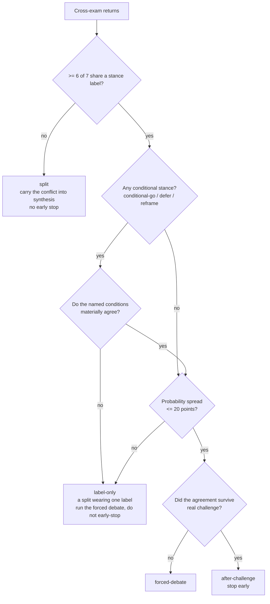

# feat: Council mechanism hardening — convergence, Round-2 value, grading

**Product Contract preservation:** no upstream requirements document. This plan was
bootstrapped from the v2.1.1 mechanism evaluation and three settled decisions taken in
session on 2026-07-31.

---

## Goal Capsule

The council's deliberation protocol has three measurement holes, all found by evaluating a
real run (Van Elst, sha `b043b80c`) rather than by reading the code. Convergence is
declared on a stance label that can hide a live split. Round 2 is the most expensive round
and nothing records whether it changes anything. And the calibration machinery — Brier,
ECE, the reliability curve, the "measured reliability" line in every synthesis — stands on
zero graded outcomes across nine runs.

This plan closes all three, plus two latent defects the research surfaced: an unguarded
8000-character budget on the ChatGPT instruction file that the convergence change must
edit, and a `journal.js` that carries the calibration maths with no test coverage.

Ships as **v2.2.0**.

---

## Problem Frame

**What is broken, concretely.**

**1. Convergence reads a label, not a position.** `SKILL.md:209-212` declares convergence
when `>= 6 of 7` seats share a STANCE. In the Van Elst run five seats returned
`conditional-go` — on materially different conditions. Had a sixth joined, the rule would
have early-stopped over a live disagreement, because `conditional-go` is a label that
absorbs any condition. The rule cannot see the difference between "we agree" and "we
agree on the word".

**2. Round 2 is unmeasured.** The anonymised cross-exam and scored ranking is the
protocol's most expensive round: seven briefs, seven cross-exams, forty-two peer scores.
The journal records only the *final* stance and probability, so there is no record of
whether any seat moved. The question "does Round 2 earn its cost" is currently
unanswerable from nine runs of data.

**3. Nothing is graded.** Nine runs, zero outcomes. `meta` returns `brier_overall: null`.
Every synthesis carries a confidence number and, since v2.1.0, a line claiming measured
reliability beside it — which today can only say "no measured track record yet". The
`pending` command and the pre-flight ledger exist but produce a count, not an action.

**Two defects found while researching this, both in scope.**

`chatgpt/INSTRUCTIONS.md` is 7911 bytes against ChatGPT's hard 8000-byte custom-instruction
limit — 89 bytes of headroom — and no check asserts it. The convergence change must edit
that file. A silent overflow truncates the GPT's protocol at whatever byte 8000 lands on.

`.claude/skills/infosec-council/journal.js` computes Brier, ECE and the reliability curve
and has no tests. `npm test` covers report rendering, version parity, desktop parity and
integrity — not the maths that decisions are calibrated against. This plan adds weight to
that file; it should not do so untested.

**Not in scope.** The two register gaps (Wbni still live for designated essential entities
until 15 August with a tighter clock than NIS2; Wwke untracked in the `frameworks.md`
scope table) are content edits to the regulatory register, not mechanism work. The stale
global install (`~/.claude/skills/infosec-council`) is an operational step, not a code
change.

---

## Requirements

| ID | Requirement |
|---|---|
| R1 | Convergence must not be declarable on stance labels alone. A shared label over divergent conditions or a wide probability spread is a split, and must be handled as one. |
| R2 | A run record must carry enough per-seat data to answer "did Round 2 move anyone", without a second deliberation pass. |
| R3 | `meta` must report the aggregate Round-2 effect in plain language, and say honestly when too few runs carry the data. |
| R4 | Grading a pending run must be a copy-pasteable action, not a lookup across three commands. |
| R5 | `confidence` must be constrained to the three documented values at log time. |
| R6 | The pending ledger must escalate when it goes stale, and must never block a run — including a live incident. |
| R7 | A grade derived from a documented exercise case must be visibly marked in the record. |
| R8 | `chatgpt/INSTRUCTIONS.md` must fail the build before it exceeds ChatGPT's 8000-byte limit. |
| R9 | All three editions must state the convergence rule consistently, or declare the non-parity with a reason in `scripts/check-desktop-parity.js`. |
| R10 | The calibration maths in `journal.js` must have test coverage before it carries more weight. |
| R11 | The nine existing journal records — none carrying Round-1 data, one carrying `confidence: "medium-high"` — must remain readable by `meta`, `journal`, `pending` and `lookback`. |

---

## Key Technical Decisions

**KTD1. Convergence = shared label AND agreeing conditions AND tight probability spread.**
*(session-settled: user-directed — chosen over probability-spread-only and
condition-naming-only: the observed failure had tight probabilities and divergent
conditions, so either axis alone misses it.)* Governs R1.

A fourth `converged` value, `label-only`, records the case where the label agrees and the
substance does not. This makes the failure mode countable across runs rather than a
judgment the chairman makes silently.

**KTD2. Instrument Round 2; do not run a replay experiment.**
*(session-settled: user-directed — chosen over re-running two logged cases with Round 2
disabled: a replay answers on n=2 and costs two full council runs, while instrumentation
costs two optional fields and compounds over every future run.)* Governs R2, R3.

The honest tradeoff: instrumentation gives no answer today. It gives a defensible one
after roughly five to ten runs.

**KTD3. One grading pool. No `kind: exercise|live` field.**
*(session-settled: user-directed — chosen over separate pools: the user accepted that
Brier and ECE will mix "we were right about a documented past case" with "our advice held
up in practice".)* Governs R7.

I flagged that these are different claims and the user chose the simpler schema. The
mitigation is presentational, not statistical: an `exercise:` prefix convention on the
outcome note, so a reader of the record can see which grades came from a case with
published ground truth. The numbers still blur; the record no longer hides it. If the
blur ever becomes load-bearing, the note prefix is a cheap migration path to a real field.

**KTD4. Record raw per-seat values; compute aggregates in `meta`.**
The run record stores what each seat said before and after Round 2. `meta` derives the
movement statistics. Storing a pre-computed `seats_moved` would freeze one definition of
"moved" into every record and make the metric unrevisable. Governs R2, R3.

**KTD5. Reject an unknown `confidence` at log time rather than normalise it.**
Silent normalisation of `medium-high` to `medium` discards the chairman's actual output and
hides a schema violation. The failure is visible, the message names the three valid values,
and the log line is trivially re-runnable. Governs R5. See Risks — this fails at the end
of a long session.

**KTD6. The budget guard lives in `scripts/sync-chatgpt.js`, and `sync-chatgpt --check`
joins `npm test`.** That script already owns the ChatGPT edition's integrity. Research
found it runs in CI (`.github/workflows/release.yml:35`) but not in `npm test`, so local
verification is currently weaker than CI — a second, independent reason to wire it in.
Governs R8.

**KTD7. A new `scripts/test-journal.js` following the `scripts/test-reports.js` pattern.**
Zero dependencies, plain `assert()`, tmpdir fixture, `COUNCIL_HOME` pointed at the tmpdir
so tests never touch the real journal. Governs R10, R11.

---

## High-Level Technical Design

The convergence rule is the one piece with enough branching that prose alone would leave
it ambiguous. Directional — the prose in `SKILL.md` is what the chairman executes.

**Journal record delta.** Additive only; every field is optional and absent on the nine
existing records.

| Field | Where | Present when | Purpose |
|---|---|---|---|
| `members[].stance_r1` | run record | Round 2 ran (not Quick) | The seat's stance before cross-exam |
| `members[].probability_r1` | run record | Round 2 ran | The seat's probability before cross-exam |
| `blind_spots_from_r2` | run record | Round 2 ran | How many synthesis blind spots first appeared in Round 2 |
| `converged: "label-only"` | run record | new fourth value | Label agreement over substantive divergence |
| `round2_value` | `meta` output | computed, never stored | Aggregate movement across runs that carry R1 data |

---

## Implementation Units

### U1. Guard the ChatGPT instruction budget

**Goal:** `chatgpt/INSTRUCTIONS.md` cannot silently exceed ChatGPT's 8000-byte limit, and
local verification matches CI. Lands first so the guard exists before U2 edits that file.

**Requirements:** R8

**Dependencies:** none

**Files:**
- `scripts/sync-chatgpt.js` — add the byte-budget assertion
- `package.json` — add `sync-chatgpt.js --check` to the `test` script
- `scripts/test-journal.js` — not this unit

**Approach:**

1. Add a `CHATGPT_INSTRUCTION_LIMIT = 8000` constant with a comment naming it as ChatGPT's
   custom-instruction ceiling, not an internal style rule.
2. In both the write and `--check` paths, measure `chatgpt/INSTRUCTIONS.md` with
   `Buffer.byteLength(content, 'utf8')` — not `.length`. The file contains non-ASCII
   (`&middot;`-class characters, accented Luméro branding); a character count would pass a
   file the platform rejects.
3. Report the current size and remaining headroom on every run, so the number is visible
   before an edit rather than after a failure.
4. Fail with the byte count, the limit, and the overage.

**Patterns to follow:** the failure-reporting shape in `scripts/check-versions.js` (a
`fail()` accumulator, a printed summary, `process.exit(1)` at the end).

**Test scenarios:** covered by direct invocation, not a harness — this unit's behaviour is
the check itself.
- `node scripts/sync-chatgpt.js --check` passes on the current tree and prints the size
  and headroom.
- Appending 200 bytes of filler to `chatgpt/INSTRUCTIONS.md` makes it exit non-zero and
  name the overage; revert the filler afterwards.
- A file containing multi-byte UTF-8 exactly at the boundary is measured in bytes: append
  filler made of multi-byte characters until the *character* count is under 8000 but the
  *byte* count is over, and confirm it still fails.
- `npm test` now runs the ChatGPT check.

**Verification:** `npm test` is green and its output includes the ChatGPT sync check; the
printed headroom figure is a real number, not a placeholder.

---

### U2. Convergence: shared label, agreeing conditions, tight spread

**Goal:** convergence can no longer be declared on a stance label that hides a split.

**Requirements:** R1, R9 — per KTD1

**Dependencies:** U1

**Files:**
- `.claude/skills/infosec-council/SKILL.md` — the convergence rule (~line 209), the
  required output block (~line 340), the journal log schema's `converged` enum (~line 292)
- `desktop/SKILL.md` — mirror (~line 153)
- `chatgpt/INSTRUCTIONS.md` — mirror (the `CONVERGENCE:` clause in the Round-2 paragraph)
- `.claude/skills/infosec-council/report.js` — render `label-only`
- `scripts/check-desktop-parity.js` — new parity needles
- `scripts/test-reports.js` — assert `label-only` renders

**Approach:**

1. **Output contract.** A seat returning a conditional stance (`conditional-go`, `defer`,
   `reframe`) must name its condition on the STANCE line in one clause. An unconditional
   `go` or `no-go` needs none. This is what makes step 2 mechanical rather than a
   re-reading of seven full answers.
2. **Convergence rule.** Replace the single label test with the three-part test in the
   diagram above: shared label, then materially agreeing conditions where conditional
   stances are present, then a probability spread of 20 points or less between the highest
   and lowest seat.
3. **The `label-only` outcome.** Shared label with divergent conditions or a wide spread
   is not convergence — it routes to the forced debate exactly as suspiciously-clean
   consensus does, and records `converged: "label-only"` so the failure mode is countable.
4. **Judgment stays with the chairman on one point only:** whether two conditions
   "materially agree". State the test in the rule — *would executing seat A's condition
   satisfy seat B?* — so it is a question with an answer rather than a vibe. The 20-point
   spread is arithmetic and needs no judgment.
5. **A conditional stance with no named condition is not convergence evidence.** State the
   fallback: treat that seat as not agreeing, and route to `label-only`. Reading silence as
   assent is the same defect one level down.
6. **ChatGPT edition.** The existing `CONVERGENCE:` clause is *replaced*, not extended.
   Draft the replacement to be no longer than what it replaces and re-run U1's guard before
   committing. If it cannot fit, cut elsewhere in that file and say which clause was cut —
   do not exceed the budget and do not ship a half-stated rule.

**Patterns to follow:** the v2.1.1 closing-checks change is the reference for this exact
shape — a rule stated in `SKILL.md`, mirrored to `desktop/SKILL.md` in that edition's
voice, condensed in `chatgpt/INSTRUCTIONS.md`, and pinned by a parity needle. The render
side is a one-line addition to the `convergedLabel` map in
`.claude/skills/infosec-council/report.js` (around line 83), which already maps the three
existing values to plain-English phrases.

**Test scenarios:**
- New parity needles (`label-only`, and a needle for the condition-naming requirement) are
  present in both `SKILL.md` and `desktop/SKILL.md`; `node scripts/check-desktop-parity.js`
  passes.
- Deleting the `label-only` clause from `desktop/SKILL.md` makes the parity guard exit
  non-zero and name the missing rule; restore it. (This regression-tests the guard itself,
  which is the only thing standing between the two editions.)
- `scripts/test-reports.js`: a fixture with `converged: "label-only"` renders a
  human-readable phrase, not the raw token and not `undefined`.
- A fixture with each of the four `converged` values renders distinctly — the three
  existing values must not have changed.
- An unknown `converged` value still degrades to no panel-outcome note rather than leaking
  the raw token, as it does today (`report.js:369` guards on the mapped label's length).
- `node scripts/sync-chatgpt.js --check` passes with the edited instruction file, and the
  printed headroom is non-negative.

**Verification:** all four `converged` values render; parity guard green and proven to fail
on a dropped clause; ChatGPT budget green with headroom shown.

---

### U3. Round-2 delta instrumentation

**Goal:** every non-Quick run records whether Round 2 moved any seat, and `meta` reports
the aggregate.

**Requirements:** R2, R3, R11 — per KTD2, KTD4

**Dependencies:** U2 (both edit the `SKILL.md` log schema; sequencing avoids a conflict)

**Files:**
- `.claude/skills/infosec-council/SKILL.md` — Round 2 instruction to preserve the Round-1
  values; the log schema gains `stance_r1`, `probability_r1`, `blind_spots_from_r2`
- `.claude/skills/infosec-council/journal.js` — `cmdMeta` gains the `round2_value` block
- `scripts/test-journal.js` — new (created here, extended by U4)
- `package.json` — add `test-journal.js` to the `test` script
- `scripts/check-desktop-parity.js` — add to `NOT_SHARED` with a reason

**Approach:**

1. **Capture.** Round 2 already asks each seat to restate its STANCE and PROBABILITY. The
   orchestrator holds both values; it currently discards the first. Instruct it to carry
   the Round-1 pair into the log record as `stance_r1` / `probability_r1`.
2. **Attribution.** The chairman already writes a `blind_spots` list. Add one instruction:
   count how many of those entries first appeared in Round 2 rather than Round 1, and log
   the count as `blind_spots_from_r2`. This is the part that measures Round 2's *unique*
   contribution rather than just churn.
3. **Aggregate in `meta`.** Over records that carry `stance_r1`, compute: number of runs
   with the data, share of runs where at least one seat changed stance, mean count of seats
   that moved, mean absolute probability delta per seat, and mean `blind_spots_from_r2`.
4. **Say when it cannot say.** Below **five** runs carrying the data, `round2_value`
   returns a note stating the sample is too small and no headline number. Five is a
   deliberate floor, not a statistical one: it is roughly where a "Round 2 never moves
   anyone" signal would stop being explicable by one unusual case, and it is reachable
   within a few weeks of normal use. Same discipline as the measured-reliability line in
   synthesis (`SKILL.md` Round 3 step 7): do not assert a number you cannot show.
5. **Desktop and ChatGPT are unaffected.** Neither has a persistent journal, so there is
   nothing to instrument. Record this in the parity guard's `NOT_SHARED` list with the
   reason, following the existing entries, so a future maintainer does not "fix" the
   absence.

**Execution note:** write the `test-journal.js` fixture for backwards compatibility
(R11) *before* touching `cmdMeta` — the nine existing records are the constraint most
likely to be broken silently, and a failing test first is the cheapest way to hold it.

**Test scenarios (`scripts/test-journal.js`, `COUNCIL_HOME` pointed at a tmpdir):**
- A record with no `stance_r1` on any member — the legacy shape — is still counted in
  `total_runs`, still appears in `journal`, and `round2_value` reports it as lacking the
  data rather than treating a missing field as zero movement.
- A record where every seat's `stance_r1` equals its final `stance` and probabilities are
  identical yields zero seats moved and zero mean delta.
- A record where two of seven seats change stance and one moves 30 probability points
  yields exactly two seats moved and a mean absolute delta of 30/7 across the panel.
- A seat whose probability moves *down* contributes its absolute value, not a negative that
  cancels another seat's gain.
- A Quick-mode record (three seats, no Round 2, no `stance_r1`) is excluded from
  `round2_value` rather than counted as "no movement".
- Below the small-sample threshold, `round2_value` returns the honest note and no headline
  number.
- `blind_spots_from_r2` absent on a record does not make the mean `NaN`.

**Verification:** `node scripts/test-journal.js` passes; `node journal.js meta` against the
real nine-record journal still runs and reports the Round-2 block as data-not-yet-available
rather than erroring.

---

### U4. Grading workflow

**Goal:** turn nine ungraded runs into nine copy-pasteable actions, and stop the confidence
vocabulary from splitting the meter.

**Requirements:** R4, R5, R6, R7, R11 — per KTD3, KTD5

**Dependencies:** U3 (both edit `journal.js` and `scripts/test-journal.js`)

**Files:**
- `.claude/skills/infosec-council/journal.js` — new `grade` command; `confidence`
  validation in `cmdLog`
- `.claude/skills/infosec-council/SKILL.md` — command routing, pre-flight escalation,
  exercise-grading convention
- `desktop/SKILL.md` — no change; already declares the journal as CLI-only
- `scripts/test-journal.js` — extend
- `README.md` — the journal command list

**Approach:**

1. **`journal.js grade [days]`.** Prints each ungraded run as a small block: sha, date,
   age, the question, the recommendation, the key assumption, and the literal
   `node journal.js outcome <sha> <result> "<note>"` line ready to edit and paste. The
   friction today is not that the user does not know grades are missing — the pre-flight
   says so on every run — it is that acting on it means reading `pending`, then finding
   the recommendation, then composing a command. This collapses that to one command.
2. **Constrain `confidence` at log time** to `low`, `medium`, `high`. The die message names
   the three values and the offending one. The existing `medium-high` record stays as it
   is; `cmdMeta` continues to bucket whatever it finds, so R11 holds.
3. **Escalating pending ledger.** `SKILL.md` step 5 keeps its one line, but the line
   sharpens when `ripe_total >= 3` or the oldest ripe run exceeds 60 days: name the count
   and the oldest date, and point at `grade`. Still one line. Still never blocking —
   restate that constraint in the rule, because the failure mode of a nagging mechanism is
   that someone eventually suppresses it during an incident.
4. **Exercise-grading convention.** Add a short `SKILL.md` note: a run against a documented
   case (the UM 2019 example, the Van Elst brief) is graded against that case's published
   ground truth and enters the same pool as a live decision. Prefix the outcome note with
   `exercise:` so the record shows which grades came from a case with known answers. State
   the tradeoff in one sentence — the pooled Brier mixes two different claims — so the
   convention carries its own justification.

**Test scenarios (extending `scripts/test-journal.js`):**
- `log` with `confidence: "medium-high"` exits non-zero and the message names `low`,
  `medium`, `high`.
- `log` with each of the three valid values succeeds.
- `log` with `confidence` absent behaves as it does today (no regression — the field is
  currently optional and `meta` buckets it as `unknown`).
- A journal seeded with the `medium-high` record still runs `meta`, `journal`, `pending`
  and `lookback` without error, and `medium-high` still appears as its own bucket. (R11:
  validating new writes must not break old reads.)
- `grade` on an empty journal prints a clear nothing-to-do message, not an empty block or a
  crash.
- `grade` on a journal with two pending and one graded run emits exactly two blocks, and
  the emitted `outcome` command line is syntactically what `outcome` accepts — assert by
  parsing the emitted line and feeding its arguments back through the outcome path.
- A pending record missing `recommendation` or `key_assumption` — the earliest logged runs
  may lack them — still produces a usable block rather than printing `undefined`.
- `grade 60` respects the day threshold the same way `pending 60` does.

**Verification:** `node scripts/test-journal.js` passes; `node journal.js grade` against the
real journal emits nine usable blocks; a pasted line from that output successfully records
an outcome against a throwaway journal.

---

### U5. Release v2.2.0

**Goal:** ship the three changes as one version with an honest changelog.

**Requirements:** all — this unit adds no behaviour

**Dependencies:** U1, U2, U3, U4

**Files:**
- `package.json`, `.claude-plugin/plugin.json`, `.claude-plugin/marketplace.json` — 2.2.0
- `CHANGELOG.md` — the v2.2.0 entry
- `README.md` — journal command list; the `converged` vocabulary if documented there
- `scripts/integrity.sha256` — regenerate

**Approach:**

Write the changelog entry around what was *observed*, matching the v2.1.1 entry's shape:
the Van Elst run's five same-labelled conditional-go stances on different conditions, the
nine runs with zero grades, and the fact that Round 2's value has never been measured.
State plainly that the Round-2 instrumentation answers nothing yet — it starts a
measurement. A changelog that implies the question is settled would be the same
over-claiming the closing checks were added to catch.

Record the pooled-grading tradeoff (KTD3) in the entry too, so the decision is discoverable
from the history rather than only from this plan.

**Test expectation: none** — no behavioural change. Verification is the full gate.

**Verification:** `npm test` green (version parity, desktop parity, integrity, reports,
journal, ChatGPT sync + budget); `node scripts/integrity.js --check` clean after
regeneration; `node bin/cli.js build-desktop` and `build-plugin` both succeed.

---

## Scope Boundaries

**In scope:** the three evaluation items, plus the ChatGPT budget guard and journal test
coverage — both are prerequisites the work would otherwise silently depend on.

### Deferred to Follow-Up Work

- **Register gaps.** Wbni remains live for designated essential entities until 15 August
  2026 with a tighter clock than NIS2; Wwke is untracked in the `frameworks.md` scope
  table. Content edits to the regulatory register, separate change.
- **Global install refresh.** `~/.claude/skills/infosec-council` still has no
  `external-websources.md` and pre-v2.1.0 personas. Operational step, not code.
- **Grading the nine pending runs.** U4 builds the tool. Actually recording the outcomes is
  the user's call and needs their knowledge of what happened, not an implementation task.
- **A real `kind: exercise|live` field.** Declined for v2.2.0 per KTD3. The `exercise:`
  note prefix is the migration path if the pooled numbers ever mislead.

### Outside this change

- Round 2's *content* (the anonymised brief, the scored ranking, the rotation rule). This
  plan measures Round 2; it does not redesign it. Any redesign should wait for the data
  U3 starts collecting.

---

## Risks & Dependencies

| Risk | Mitigation |
|---|---|
| **The ChatGPT budget cannot absorb U2's convergence text.** 89 bytes of headroom against a rule that gains two clauses. | U1 lands first and prints headroom on every run. U2's approach requires *replacing* the existing clause and explicitly permits cutting elsewhere — but requires naming what was cut. Shipping a half-stated rule is the failure to avoid. |
| **KTD5 fails a log at the end of a long council session.** A rejected `confidence` value means the run is not journaled at the moment it finishes. | The die message names the fix, and the log line is a single re-runnable command. `SKILL.md`'s logging step should say: if the log fails, correct the value and re-run it — do not skip. Add that sentence in U4. |
| **`round2_value` reads as a finding on a sample of two.** | U3 step 4 makes the small-sample note mandatory below the threshold. Same discipline as the measured-reliability line. |
| **The pooled grading blur (KTD3) misleads a future reader** who sees a Brier score built mostly from exercise runs against published answers. | The `exercise:` note prefix makes it visible in the record. The changelog entry states the tradeoff. This is a mitigated, accepted risk, not a solved one. |
| **The `materially agree` judgment in U2 becomes a rubber stamp.** The chairman is the same model that ran the panel — the failure mode v2.1.1 was built to catch. | The rule states the test as a question with an answer (*would executing A's condition satisfy B?*). The v2.1.1 closing check already asks about manufactured unanimity in every mode, and a `label-only` outcome recorded as `after-challenge` is exactly what that check should catch. |
| **`blind_spots_from_r2` is self-reported by the same model that ran both rounds.** It measures Round 2's unique contribution — and is exactly the kind of number that model has an interest in. | Accepted, with the reason recorded: unlike the stance and probability deltas beside it, this one is an attribution, not an arithmetic fact. `meta` should report it separately from the movement statistics rather than blended in, so a reader can weigh the hard numbers on their own. Fold this into U3 step 3. |
| **Backwards compatibility with nine live records.** | R11 is a first-class requirement with its own test scenarios in both U3 and U4. The execution note on U3 puts those tests first. |

---

## Verification Contract

The gate for every unit is `npm test`, which after U1 and U3 runs six checks: version
parity, desktop parity, integrity, report golden-file tests, journal tests, and ChatGPT
sync + budget.

Two checks must be proven to actually fail, not merely observed to pass — a guard that has
never failed is an untested guard:

1. Delete a `label-only` clause from `desktop/SKILL.md` → `check-desktop-parity.js` exits
   non-zero and names it. Restore.
2. Append filler to `chatgpt/INSTRUCTIONS.md` → `sync-chatgpt.js --check` exits non-zero
   and names the overage. Revert.

Beyond the harness: `node journal.js meta` and `node journal.js grade` must both run
cleanly against the real nine-record journal at `~/.infosec-council/journal.jsonl`.

---

## Definition of Done

- All four `converged` values are stated in the council orchestrator, mirrored in
  `desktop/SKILL.md`, condensed in `chatgpt/INSTRUCTIONS.md`, pinned by parity needles, and
  rendered by `report.js`.
- A non-Quick run logs `stance_r1` and `probability_r1` per seat plus
  `blind_spots_from_r2`, and `meta` reports the aggregate or says why it cannot.
- `journal.js grade` emits paste-ready outcome commands for every pending run.
- `confidence` outside `low|medium|high` is rejected at log time with a message naming the
  valid values.
- The nine existing records remain readable by all five journal commands.
- `chatgpt/INSTRUCTIONS.md` is guarded at 8000 bytes, measured in bytes, in both CI and
  `npm test`.
- `scripts/test-journal.js` exists and is wired into `npm test`.
- Both negative tests above were run and observed to fail correctly.
- Version 2.2.0 across all three manifests; CHANGELOG entry written; integrity manifest
  regenerated; `npm test` green.

---

## Sources & Research

Grounded in this repository and one logged run; no external research (the change shape is
settled by the three session decisions, and this repo carries three prior instances of the
same change pattern — v2.0.0, v2.1.0, v2.1.1).

- Council run `b043b80c` (Van Elst invoice fraud, deep, 2026-07-31) — five of seven seats
  returned `conditional-go` on materially different conditions. The observation behind R1.
- `node journal.js meta` against `~/.infosec-council/journal.jsonl` — nine runs, zero
  outcomes, `brier_overall: null`, and one `confidence: "medium-high"` bucket. The
  observation behind R4 and R5.
- `chatgpt/INSTRUCTIONS.md` — 7911 bytes, no guard. The observation behind R8.
- `.github/workflows/release.yml:35` vs `package.json` `test` — `sync-chatgpt --check` runs
  in CI but not locally. The second reason behind KTD6.
- `scripts/check-desktop-parity.js` — the `SHARED_POLICY` / `NOT_SHARED` pattern U2 and U3
  extend, and its header comment explaining why a whole-file diff is the wrong tool here.
- `scripts/test-reports.js` — the zero-dependency test pattern `test-journal.js` follows.
